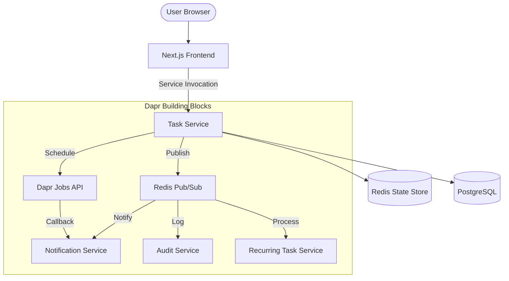

# Todo Chatbot - Phase 5 Distributed Microservices


A production-grade, spec-driven todo application decomposed into a distributed microservices architecture. Powered by **Dapr** building blocks for state management, pub/sub, and job scheduling, with **Redis** as the unified infrastructure backbone.

## 🏗️ Architecture

The system is built on a decoupled, event-driven architecture where microservices communicate asynchronously via Dapr sidecars.



### Microservices Breakdown
- **`task-service`**: Core business logic, CRUD operations, and event publishing.
- **`notification-service`**: Handles exact-time reminders via the Dapr Jobs API.
- **`recurring-task-service`**: Automates task repetition based on completion events.
- **`audit-service`**: Provides a distributed audit trail of all task activities.

---

## 🚀 Local Setup Guide

### Prerequisites
- [Minikube](https://minikube.sigs.k8s.io/docs/start/)
- [Docker Desktop](https://www.docker.com/products/docker-desktop/)
- [Kubectl](https://kubernetes.io/docs/tasks/tools/)
- [Dapr CLI](https://docs.dapr.io/getting-started/install-dapr-cli/) (initialized on the cluster)

### 1. Start Your Cluster
```bash
minikube start
minikube dashboard # Optional: Open dashboard in a new terminal
```

### 2. Configure Docker Environment
Point your local Docker CLI to the Minikube registry to avoid pushing to external registries:
```powershell
# Windows (PowerShell)
minikube docker-env | Invoke-Expression

# macOS/Linux
eval $(minikube -p minikube docker-env)
```

### 3. Build Service Images
Build all services using the unified microservice Dockerfile:
```bash
# Build main services
docker build -t backend:phase5 ./backend
docker build -t frontend:phase5 ./frontend --build-arg NEXT_PUBLIC_API_URL=http://localhost:8000

# Build supporting microservices
docker build -t notification-service:phase5 -f src/shared/Dockerfile.microservice --build-arg SERVICE_NAME=notification_service .
docker build -t recurring-service:phase5 -f src/shared/Dockerfile.microservice --build-arg SERVICE_NAME=recurring_task_service .
docker build -t audit-service:phase5 -f src/shared/Dockerfile.microservice --build-arg SERVICE_NAME=audit_service .
```

### 4. Deploy Infrastructure & Components
Deploy Redis and the Dapr building block configurations:
```bash
kubectl apply -f deploy/redis.yaml
kubectl apply -f deploy/dapr-components/
```

### 5. Deploy Application Services
Apply the Kubernetes manifests for all microservices:
```bash
kubectl apply -f deploy/
```

---

## 🏃 Running the Application

### Accessing the App
To access the services from your host machine, use `kubectl port-forward`:

```powershell
# Terminal 1: Frontend
kubectl port-forward svc/frontend 3000:80

# Terminal 2: Backend API
kubectl port-forward svc/backend 8000:80
```

- **Frontend**: [http://localhost:3000](http://localhost:3000)
- **API Documentation**: [http://localhost:8000/docs](http://localhost:8000/docs)

### Verification Commands
```bash
# Verify Dapr components
dapr list -k

# Monitor Audit Logs
kubectl logs -l app=audit-service -c audit-service --tail=50
```

---

## 🛠️ Dapr Building Blocks
This project leverages the following Dapr capabilities:
- **Pub/Sub**: Redis-backed asynchronous event flow across services.
- **State Management**: Key-value storage for user sessions and caching.
- **Jobs API (Alpha)**: Scheduling exact-time triggers for the notification system.
- **Service Invocation**: secure, cross-service communication with mTLS.

---

## 🔒 Security & Secrets

To keep your credentials safe when pushing to GitHub:

1.  **Environment Files**: The project includes `env.example` files in both `backend/` and `frontend/`. 
    - Copy them to `.env` and `.env.local` respectively.
    - Fill in your actual credentials.
    - **Never** commit `.env` files (they are already in `.gitignore`).
2.  **Kubernetes Secrets**: The `deploy/backend.yaml` file has been sanitized. 
    - Locate the `backend-secret` section.
    - Replace the placeholder values with your actual base64-encoded secrets before running `kubectl apply`.

---

## 🤝 Contributing
This project follows **Spec-Driven Development (SDD)** standards. Ensure all architectural changes are documented via ADRs (Architectural Decision Records) in `/history/adr`.
